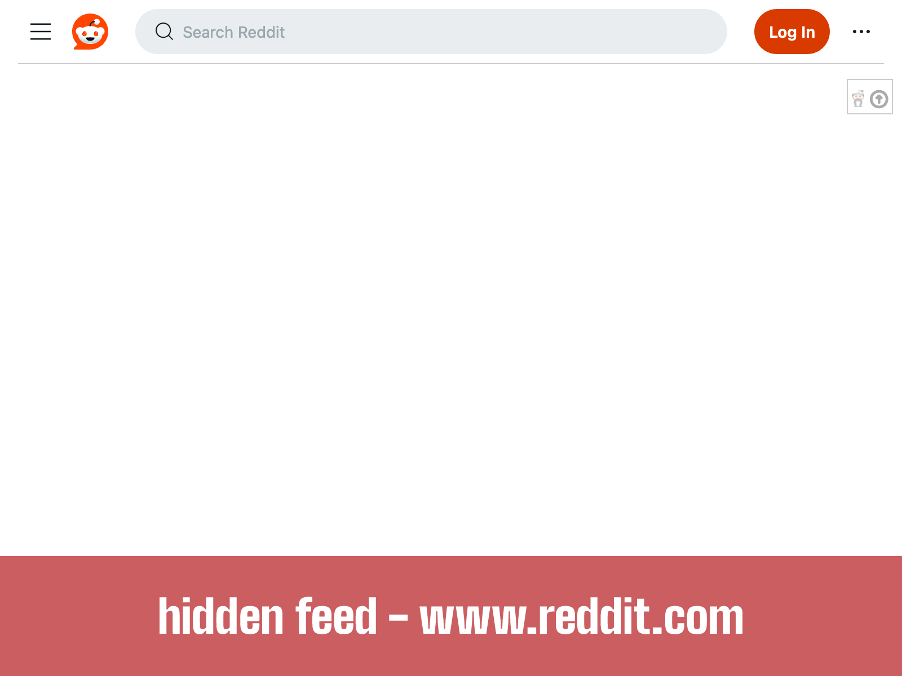

# Reddit Blocker

This browser extension blocks the feed on the reddit homepage, /r/all, and can optionally block the feed of any other subreddit you choose. 

Reddit is a great source of knowledge and information on countless topics, but often after finding what you were searching for you become enticed by memes, current affairs and endlessly scrolling junk information on the homepage. This extension seeks to prevent getting caught in the endless scrolling by removing the feed from the reddit homepage.

Compatible with old.reddit.com and www.reddit.com.

Inspired by Unhook and extensions which block the Youtube homepage.

Install for Firefox https://addons.mozilla.org/en-US/firefox/addon/reddit-blocker/

